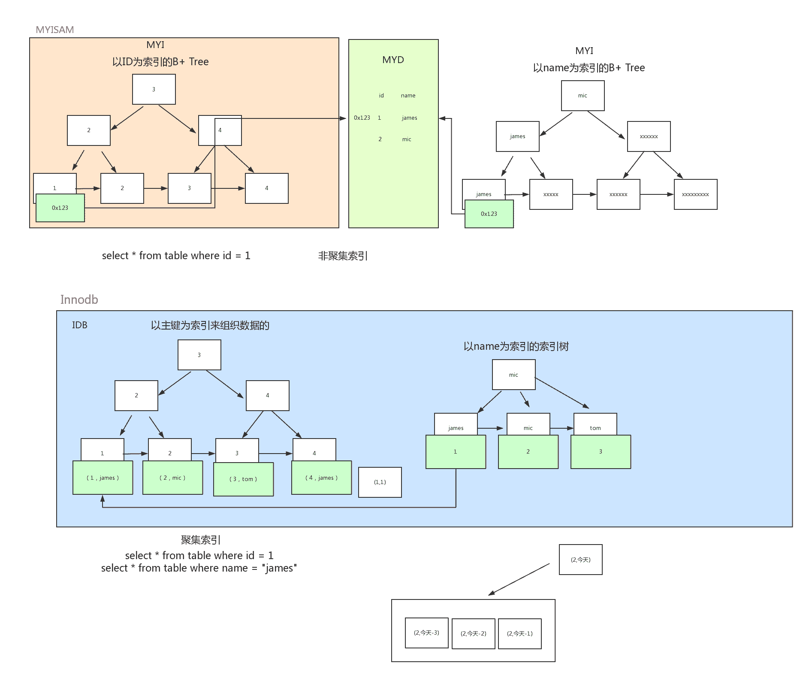

### 存储引擎
- MyISAM  B+Tree索引(非聚簇索引)，叶子节点的 data 域存放的是 数据记录的地址(因为索引文件与数据文件的分离的)
- InnoDB  B+Tree索引(聚簇索引/非聚簇索引)，叶子节点的 data 域存放的是 要看是 聚簇索引 还是 非聚簇索引
- Memory  Hash索引
  
> 注意: InnoDB 提供 `自适应 Hash 索引` 如果某个数据经常被访问后满足条件的时候 数据地址 会存放到 Hash 表中，从而让 B+树 也具备了 Hash 索引的优点

## 索引
> `聚簇索引` 具有唯一性，由于聚簇索引是将数据跟索引结构放到一块，因此一张表仅有一个聚簇索引，默认是主键
- 对于主键的 `排序查找` 和 `范围查找` 速度非常快
- 插入速度严重依赖于插入顺序
- 叶子节点的 data 域存放的是 数据
- 目前只有 InnoDB 支持，且每张表只有一个聚簇索引(主键)，没有主键会优先选择`非空的唯一索引`没有则隐式创建

> `非聚簇索引` 也称为二次索引(辅助索引)，而叶子节点存储的不再是行的物理位置，而是主键值，辅助索引访问数据总是需要二次查找(第一次找到主键，第二次根据主键值找到行数据)
- 叶子节点的 data 域存放的是 主键

> 都是使用`B+`树(B+Tree)索引

