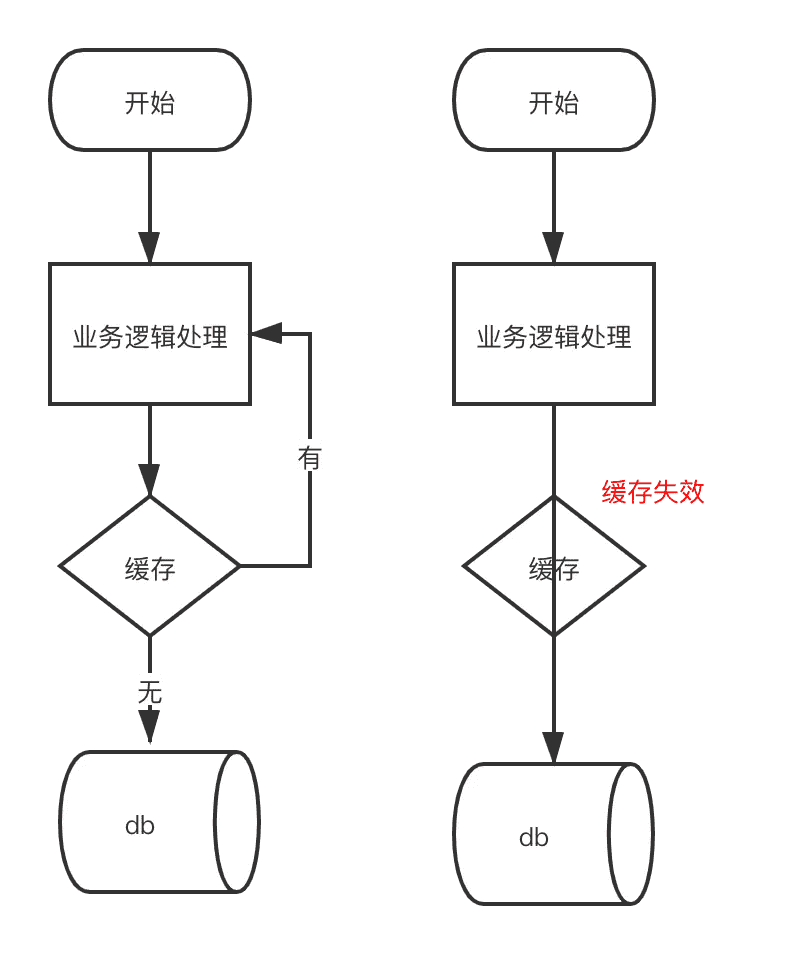

### 缓存雪崩
> 主要是`热点数据`的缓存`失效时间`为一样，当缓存所有的 Key 都失效了，请求全部去查数据库，数据库必然扛不住(在并发下是来不及缓存的)

> 解决方法
- 1. 每个 Key 的失效时间都加个`随机值`，保证数据不会在同一时间大面积失效
- 2. 将`热点数据`设置不过期
- 3. 限流 与 本地缓存

### 缓存穿透
> 在正常的情况下，用户查询数据都是存在的，但是在异常情况下，缓存与数据都没有数据，但是用户不断发起请求，这样每次请求都会打到数据库上面去

> 解决方法
- 1. 缓存空值

### 缓存击穿
> 平常高并发的系统中，大量的请求同时查询一个 key 时，假设此时，这个 key 正好失效了，就会导致大量的请求都打到数据库上面去，这种现象我们称为击穿
- 1. 将 key 设置不过期
- 2. 互斥锁，此时系统吞吐量会下降，需要结合实际的业务

