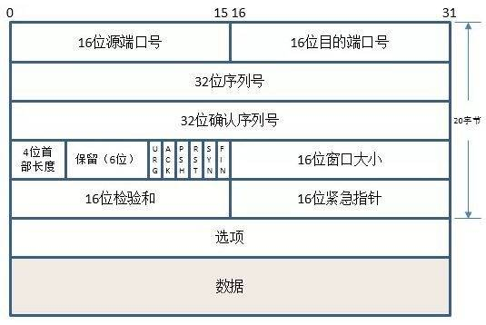
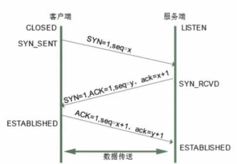
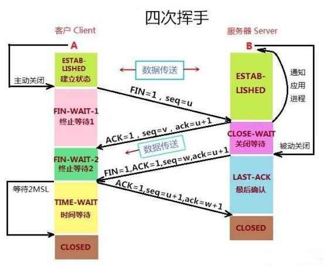

# TCP 协议：三次握手与四次挥手

## TCP 头部结构

## 三次握手（建立连接）

三次握手用于在客户端与服务端之间建立可靠的 TCP 连接，过程如下：

1. **第一次**：客户端发送 `SYN`（同步序列号）报文，进入 `SYN_SENT` 状态。
2. **第二次**：服务端收到后，回复 `SYN + ACK` 报文，进入 `SYN_RCVD` 状态。
3. **第三次**：客户端收到后，回复 `ACK` 报文，双方进入 `ESTABLISHED`（已建立）状态。

## 四次挥手（断开连接）

四次挥手用于关闭 TCP 连接，因为 TCP 是全双工的，每个方向都需要单独关闭：

1. **第一次**：主动关闭方发送 `FIN` 报文，表示不再发送数据。
2. **第二次**：被动关闭方回复 `ACK`，表示收到关闭请求。
3. **第三次**：被动关闭方发送 `FIN` 报文，表示自己也准备关闭。
4. **第四次**：主动关闭方回复 `ACK`，连接关闭。

