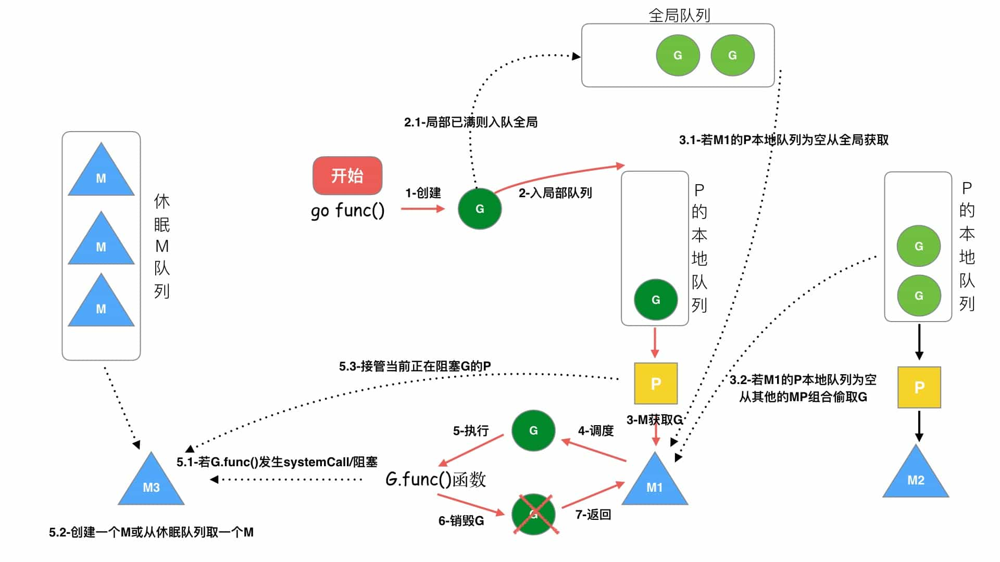

> G：表示协程(Goroutine)
>
> M：表示线程(thread)
>
> P：表示处理器(Processor)

在Go中，**线程是运行goroutine的实体，调度器的功能是把可运行的goroutine分配到工作线程上**

- `全局队列(Global Queue)`：存放等待运行的G
- `P的本地队列`：同全局队列类似，存放的也是等待运行的 G，存的数量有限，不超过256个。新建 G 时，G 优先加入到 P 的本地队列，如果队列满了，则会把本地队列中`前半部分`(一半)的 G 和自已 移动到全局队列
- `P列表`：所有的P都在程序启动时创建，并保存在数组中，最多有GOMAXPROCS(可配置)个
- `M`：线程想运行任务就得获取 P，从 P 的本地队列获取 G，P 队列为空时(M会变成自旋线程)，M 也会尝试从全局队列拿一批 G 放( min(len(GQ全局队列)/GOMAXPROCS+1, len(GQ/2)) )到 P 的本地队列，或从其他 P 的本地队列偷`后半部分`(一半)放到自己 P 的本地队列。M 运行 G，G 执行之后，M 会从 P 获取下一个 G，不断重复下去

> Goroutine调度器和OS调度器是通过M结合起来的，每个M都代表了1个内核线程，OS调度器负责把内核线程分配到CPU的核上执行

> #### 有关P和M的个数问题

- P 的数量
- - 由启动时环境变量 `$GOMAXPROCS` 或者是由 `runtime` 的方法 `GOMAXPROCS()` 决定。这意味着在程序执行的任意时刻都只有 `$GOMAXPROCS` 个 goroutine 在同时运行
- M 的数量
- - go语言本身的限制：go程序启动时，会设置M的最大数量，默认 10000 但是内核很难支持这么多的线程数，所以这个限制可以忽略
- - runtime/debug中的 SetMaxThreads 函数，设置M的最大数量
- - 是动态变化的，当有 M 空闲时就会回收或睡眠，当有 M 阻塞了( G 阻塞)，会创建新的 M (会把当前的 P 移动到新 M 下)

> P和M何时会被创建

- P 何时创建：在确定了 P 的最大数量 n 后，运行时系统会根据这个数量创建 n 个 P
- M 何时创建：没有足够的 M 来关联 P 并运行其中的可运行的G，比如所有的 M 此时都阻塞住了，而 P 中还有很多就绪任务，就会去寻找空闲的 M，而没有空闲的，就会去创建新的 M

所以总结出 M 与 P 的数量没有绝对关系，一个 M 阻塞，P 就会去创建或者切换另一个 M，即使 P 的默认数量是 1，也有可能会创建很多个 M 出来

> 调度器的设计策略

- **复用线程**：避免频繁的创建、销毁线程，而是对线程的复用
- - 当本线程无可运行的 G 时，尝试从其他线程绑定的 P 偷取 G，而不是销毁线程。(work stealing机制)
- - 当本线程因为 G 进行系统调用阻塞时，线程释放绑定的 P，把 P 转移给其他空闲的线程执行。(hand off机制)
- **利用并行**：`GOMAXPROCS` 设置 P 的数量，最多有 `GOMAXPROCS` 个线程分布在多个 CPU 上同时运行
- **抢占**：在 coroutine 中要等待一个协程主动让出 CPU 才执行下一个协程，在 Go 中，一个 goroutine 最多占用 CPU 10ms，防止其他 goroutine 被饿死，这就是 goroutine 不同于 coroutine 的一个地方。
- **全局 G 队列**：在新的调度器中依然有全局 G 队列，但功能已经被弱化了，当 M 执行 work stealing 从其他 P 偷不到 G 时，它可以从全局 G 队列获取 G

> ####  go func() 调度流程

> 从上图我们可以分析出几个结论：
- 我们通过 go func() 来创建一个 goroutine
- 有两个存储 G 的队列，一个是局部调度器P的本地队列、一个是全局 G 队列。新创建的 G 会先保存在 P 的本地队列中，如果 P 的本地队列已经满了就会保存在全局的队列中
- G 只能运行在 M 中，一个 M 必须持有一个 P，M 与 P 是1：1的关系。M 会从 P 的本地队列弹出一个可执行状态的 G 来执行，如果 P 的本地队列为空，就会想其他的 M P 组合偷取一个可执行的 G 来执行
- 一个 M 调度 G 执行的过程是一个循环机制
- 当 M 执行某一个 G 时候如果发生了 syscall 或则其余阻塞操作，M 会阻塞，如果当前有一些 G 在执行，runtime 会把这个线程 M 从 P 中摘除(detach)，然后再创建一个新的操作系统的线程(如果有空闲的线程可用就复用空闲线程)来服务于这个 P
- 当 M 系统调用结束时候，这个 G 会尝试获取一个空闲的 P 执行，并放入到这个 P 的本地队列。如果获取不到P，那么这个线程 M 变成休眠状态， 加入到空闲线程中，然后这个 G 会被放入全局队列中

### 特殊的 M0 和 G0
> `M0` 是启动程序后的 `编号为0` 的主线程，这个 M 对应的实例会在全局变量 runtime.m0 中，不需要在 heap 上分配，M0 负责执行初始化操作和启动第一个 G， 在之后 M0 就和其他的 M 一样了
> 
> `G0` 是每次启动一个 M 都会第一个创建的 gourtine，G0 仅用于负责调度的 G，G0 不指向任何可执行的函数, 每个 M 都会有一个自己的 G0